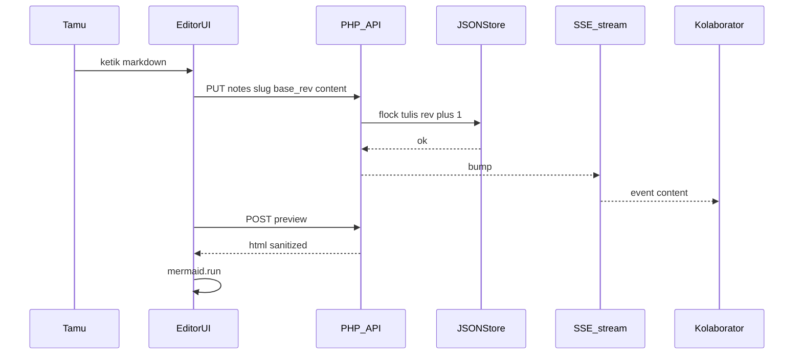
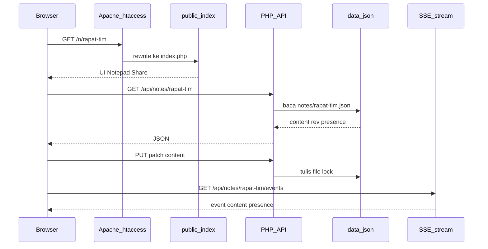
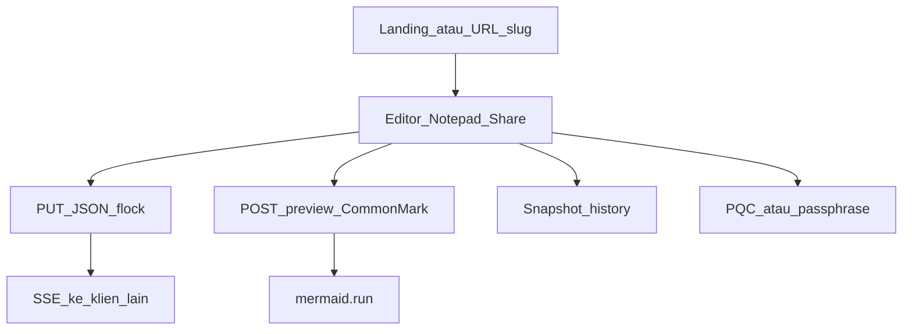

# Software Design Document — Notepad Share

| Field | Nilai |
| --- | --- |
| Nama aplikasi | Notepad Share |
| Versi dokumen | 1.0 |
| Tanggal | 2026-09-16 |
| Runtime | PHP 8.2 (native, tanpa framework) |
| Penyimpanan | File JSON + unggahan gambar di disk |
| Referensi UI | `collabmark.html` |
| Status | Disetujui untuk desain; implementasi aplikasi terpisah |

**Keputusan arsitektur:** Laravel 12 dan MySQL `db_notepad_share` **tidak dipakai**. Penyimpanan dan identitas mengikuti PHP session + JSON + Apache `.htaccess`.

**Rujukan teknis Markdown/Mermaid:**

- [Best Markdown libraries for PHP (PHP.Watch)](https://php.watch/articles/php-markdown-libraries)
- [mermaid-js/mermaid](https://github.com/mermaid-js/mermaid)

---

## 1. Pendahuluan

### 1.1 Tujuan produk

Notepad Share menjembatani banyak pengguna agar mengolah **satu file Markdown atau plain text yang sama secara realtime**. Siapa pun yang membuka URL ruang yang sama melihat dan menulis ke dokumen bersama. Identitas pengguna berbasis **session PHP** (tanpa wajib daftar akun). Enkripsi opsional memakai **PQC hybrid (ML-KEM-768 + AES-GCM)** di klien. History dapat dihapus otomatis menurut retensi 1 jam hingga 7 hari, atau disimpan permanen. Gambar dapat dilampirkan. Diagram Mermaid dirender di browser dari blok fenced `mermaid`.

### 1.2 Masalah yang diselesaikan

- Kolaborasi catatan cepat tanpa akun dan tanpa database relasional.
- Satu tautan kustom (`/n/{slug}`) sebagai “ruang” bersama.
- Editor lengkap (toolbar Markdown, preview, tema) dengan sumber kebenaran konten di server JSON.
- Preview Markdown yang konsisten: parser hanya di PHP (`league/commonmark`), bukan parser JS kedua.
- Kerahasiaan opsional lewat ciphertext yang server tidak bisa baca (mode terenkripsi).

### 1.3 Definisi istilah

| Istilah | Arti |
| --- | --- |
| Ruang / room / catatan | Satu dokumen kolaboratif, diidentifikasi `slug` |
| Session | Identitas tamu PHP (`PHPSESSID`) |
| `rev` | Nomor revisi monoton; tiap tulis yang diterima menaikkan `rev` |
| LWW | Last-write-wins: tulis dengan `base_rev` cocok yang menang |
| SSE | Server-Sent Events untuk push perubahan |
| PQC | Post-quantum cryptography; di sini ML-KEM-768 (Kyber) |
| GFM | GitHub Flavored Markdown |

---

## 2. Ruang lingkup

### 2.1 Termasuk

- Landing buat/buka ruang; editor+preview (edit / split / preview).
- Format Markdown dan TXT; toolbar format; lampiran gambar (maks 3 MB).
- Render Markdown server-side (`league/commonmark` + GFM).
- Render diagram Mermaid di klien (mermaid-js).
- URL kustom slug; session pengguna; presence (siapa online).
- History snapshot + retensi; hapus history ruang.
- Enkripsi/dekripsi PQC (klien) + fallback AES-GCM.
- Tema gelap/terang; `.htaccess`; JSON store; PHP 8.2; Composer hanya untuk CommonMark.

### 2.2 Tidak termasuk

- Laravel, Eloquent, migrasi MySQL, database `db_notepad_share`.
- OAuth, email, verifikasi akun.
- CRDT Yjs dan WebSocket publik `wss://demos.yjs.dev`.
- Parser `markdown-it` di UI produksi (menghindari dua hasil HTML berbeda).
- Rendering SVG Mermaid di PHP.

---

## 3. Aktor dan use case

### 3.1 Aktor

| Aktor | Deskripsi |
| --- | --- |
| Tamu | Pengunjung dengan session; dapat membuat ruang, mengedit, share |
| Kolaborator | Tamu lain di slug yang sama |
| Cron | Proses prune history kadaluarsa |
| Apache | Front controller + proteksi `data/` |

### 3.2 Use case

| ID | Nama | Aktor | Ringkasan |
| --- | --- | --- | --- |
| UC-01 | Buat ruang | Tamu | Isi slug kustom atau slug acak; format default `md` |
| UC-02 | Buka ruang | Tamu | GET `/n/{slug}`; session dibuat jika belum ada |
| UC-03 | Edit bersama | Tamu, kolaborator | Ketik; debounce PUT; SSE memperbarui klien lain |
| UC-04 | Ganti format | Tamu | MD ↔ TXT; toolbar MD disembunyikan di TXT |
| UC-05 | Preview | Tamu | Debounce POST `/api/preview`; lalu mermaid.run |
| UC-06 | Lampir gambar | Tamu | Upload; sisip `` |
| UC-07 | Share URL | Tamu | Salin URL absolut ruang |
| UC-08 | Snapshot history | Tamu | Manual (Ctrl+S) atau interval 30 detik |
| UC-09 | Pulihkan history | Tamu | Klik item; content diganti; `rev` naik |
| UC-10 | Atur retensi | Tamu | 1 jam / 6 jam / 12 jam / 1 hari / 3 hari / 7 hari / permanen |
| UC-11 | Hapus history | Tamu | Hapus semua snapshot ruang |
| UC-12 | Enkripsi PQC | Tamu | Hasil `PQC1:` atau `AES1:`; opsi simpan sebagai konten ruang |
| UC-13 | Dekripsi | Tamu | Paste ciphertext; kunci session/IndexedDB harus cocok |
| UC-14 | Ganti nama tampilan | Tamu | Update session + presence |
| UC-15 | Prune | Cron | Hapus file history lebih tua dari `retention_ms` |



---

## 4. Kebutuhan non-fungsional

| ID | Kategori | Target |
| --- | --- | --- |
| NFR-01 | Kinerja preview | Debounce 250–400 ms; catatan tipikal < 100 KB |
| NFR-02 | Sync | PUT debounce 300–500 ms; SSE; fallback poll 1,5 s |
| NFR-03 | Keamanan | `data/` tidak terlayani HTTP; CSRF pada mutasi; allowlist HTML |
| NFR-04 | Privasi PQC | Secret key hanya di IndexedDB klien |
| NFR-05 | Ketersediaan | Apache + PHP 8.2 Laragon; file lock anti korupsi JSON |
| NFR-06 | Aksesibilitas | Label tombol, Esc tutup modal, kontras tema |
| NFR-07 | Responsif | Mobile: satu pane + FAB; desktop: split + divider |
| NFR-08 | Ukuran unggah | Maks 3 MB per gambar; MIME magis |

---

## 5. Arsitektur sistem

### 5.1 Gaya

PHP native front controller. Tidak ada framework MVC wajib, tetapi pemisahan: Router, Session, store JSON, controller API. UI satu berkas HTML/CSS/JS di `public/assets/app.html` (adaptasi `collabmark.html`, merek **Notepad Share**).

### 5.2 Alur permintaan halaman



### 5.3 Realtime (PHP-only)

- **Model:** last-write-wins + `rev` integer mulai 1.
- **Tulis:** klien mengirim `base_rev`. Jika `base_rev !== rev` server, respons `409 Conflict` + body terbaru. Klien menimpa editor (kecuali fokus lokal: toast “diperbarui dari rekan” lalu merge sederhana = terima server jika idle > 800 ms, jika mengetik tampilkan banner).
- **Push:** SSE `text/event-stream`; event `note` (`rev`, `updated_by`) tanpa body penuh jika besar; klien kemudian GET catatan, atau event `note` membawa `content` jika < 256 KB.
- **Fallback:** jika SSE gagal, `GET` polling 1500 ms dengan `If-None-Match: "{rev}"` / header `ETag`.
- **Presence:** heartbeat `POST /api/notes/{slug}/presence` tiap 10 detik. Entri `last_seen` > 25 detik dianggap offline dan dibuang saat baca.

Konflik disengaja sederhana: bukan OT/CRDT. Cocok catatan kecil–sedang, bukan IDE.

### 5.4 Struktur direktori target

```
notepad-share/
  composer.json                 # league/commonmark ^2
  vendor/                       # Composer
  docs/SDD_Notepad_Share.md
  collabmark.html               # prototipe UI (referensi)
  public/
    .htaccess
    index.php                   # front controller
    assets/app.html             # HTML+CSS+JS editor
  app/
    bootstrap.php
    Router.php
    Session.php
    Csrf.php
    MarkdownRenderer.php        # CommonMark + mermaid fence + sanitasi
    NoteStore.php
    HistoryStore.php
    UploadStore.php
    controllers/
      HomeController.php
      SessionController.php
      NoteController.php
      PreviewController.php
      HistoryController.php
      ImageController.php
  data/
    .htaccess                   # Deny from all (cadangan)
    notes/{slug}.json
    history/{slug}/{ts}_{sid}.json
    uploads/{slug}/{id}.{ext}
  cron/prune.php
```

`data/` di luar `public/` agar tidak terlayani sebagai dokumen statis.

---

## 6. Routing dan `.htaccess`

### 6.1 Aturan Apache (`public/.htaccess`)

- `RewriteEngine On`
- `RewriteBase` menyesuaikan vhost (`/` jika DocumentRoot = `public`) atau `/notepad-share/public/` di Laragon subfolder.
- File/folder nyata di `public/` dilayani apa adanya (`assets/`).
- Selain itu rewrite ke `index.php`.
- Header keamanan disarankan: `X-Content-Type-Options nosniff`, `Referrer-Policy same-origin`.
- `Options -Indexes`.

Cadangan `data/.htaccess`: `Require all denied`.

### 6.2 Peta URL

| Metode | Path | Handler | Auth |
| --- | --- | --- | --- |
| GET | `/` | Landing / wizard akses | Session mulai |
| GET | `/n/{slug}` | Editor jika berhak, selain itu landing | Session |
| GET | `/n/{slug}/img/{id}` | Stream gambar | Akses ruang |
| GET | `/api/session` | Profil session | Ya |
| PATCH | `/api/session` | Ganti `display_name` | Ya + CSRF |
| POST | `/api/notes` | Buat ruang (retensi, default unlocked) | Ya + CSRF |
| GET | `/api/notes/{slug}/access` | Meta ada/kunci/password/owner | Ya |
| POST | `/api/notes/{slug}/unlock` | Buka kunci dengan password | Ya + CSRF |
| POST | `/api/notes/{slug}/lock` | Toggle lock (hanya owner) | Ya + CSRF |
| GET | `/api/notes/{slug}` | Baca catatan + presence | Akses ruang |
| PUT | `/api/notes/{slug}` | Simpan content/format/retention | Akses + CSRF |
| DELETE | `/api/notes/{slug}` | Hapus seluruh ruang (hanya owner) | Akses + CSRF |
| GET | `/api/notes/{slug}/events` | SSE | Ya |
| POST | `/api/notes/{slug}/presence` | Heartbeat | Ya + CSRF |
| GET | `/api/notes/{slug}/history` | Daftar snapshot | Ya |
| POST | `/api/notes/{slug}/history` | Buat snapshot | Ya + CSRF |
| POST | `/api/notes/{slug}/history/{id}/restore` | Pulihkan | Ya + CSRF |
| DELETE | `/api/notes/{slug}/history` | Hapus semua history ruang | Ya + CSRF |
| POST | `/api/notes/{slug}/images` | Unggah | Ya + CSRF |
| POST | `/api/preview` | Markdown/TXT → HTML | Ya + CSRF |

### 6.3 Aturan slug

- Regex: `^[a-z0-9][a-z0-9-]{1,62}$`
- Normalisasi ke huruf kecil.
- Dilarang: `api`, `n`, `assets`, `index`, `.`, `..`.
- Jika slug tidak ada: GET editor **tidak** membuat ruang. Pengguna diarahkan ke landing untuk pilih retensi dan password, lalu `POST /api/notes`.

---

## 7. Model data JSON

### 7.1 Catatan — `data/notes/{slug}.json`

```json
{
  "slug": "rapat-tim",
  "title": "rapat-tim",
  "format": "md",
  "content": "# Judul\n",
  "rev": 12,
  "updated_at": "2026-09-16T13:00:00+07:00",
  "updated_by": "a1b2c3d4e5f6a1b2c3d4e5f6a1b2c3d4",
  "retention_ms": 86400000,
  "encrypted": false,
  "owner_session_id": "(internal, tidak dikirim ke klien)",
  "locked": true,
  "password_hash": "(internal)",
  "access_gen": 1,
  "created_at": "2026-09-16T08:00:00+00:00",
  "presence": [
    {
      "session_id": "a1b2c3d4e5f6a1b2c3d4e5f6a1b2c3d4",
      "display_name": "user-a3f2",
      "color": "#6366f1",
      "last_seen": "2026-09-16T13:00:05+07:00"
    }
  ]
}
```

| Field | Tipe | Aturan |
| --- | --- | --- |
| `format` | string | `md` \| `txt` |
| `content` | string | UTF-8; jika `encrypted` true, prefix `PQC1:` atau `AES1:` |
| `rev` | int | >= 1; increment atomik di dalam `flock` |
| `retention_ms` | int | lihat §10; `0` = permanen; juga TTL ruang dari `created_at` |
| `encrypted` | bool | server tidak mendekripsi |
| `locked` | bool | default `false` pada ruang baru; lock wajib password baru; unlock menghapus hash |
| `has_password` / `is_owner` | bool | hanya di payload publik, bukan file JSON |

Tulis file: buka `c+b`, `flock(LOCK_EX)`, baca, ubah, `ftruncate`, tulis, `fflush`, unlock.

### 7.2 History — `data/history/{slug}/{unix}_{session8}.json`

```json
{
  "id": "1726470000_a3f2c9e1",
  "slug": "rapat-tim",
  "content": "...",
  "user": "user-a3f2",
  "session_id": "a1b2c3d4e5f6a1b2c3d4e5f6a1b2c3d4",
  "ts": 1726470000000,
  "len": 420
}
```

Deduplikasi: jangan simpan jika identik dengan snapshot terakhir ruang.

### 7.3 Unggahan

- Path: `data/uploads/{slug}/{id}.{ext}`
- `id`: 16 byte hex acak.
- `ext`: dari MIME: jpeg→jpg, png, gif, webp saja.
- Markdown: `` — `id` tanpa ekstensi; server menambahkan ekstensi dari indeks `data/uploads/{slug}/manifest.json` opsional, atau glob satu file `{id}.*`.

**Manifest opsional** `data/uploads/{slug}/index.json`:

```json
{
  "files": [
    { "id": "ab12cd34ef56ab12", "ext": "png", "mime": "image/png", "bytes": 12000, "original": "foto.png" }
  ]
}
```

Tidak menyimpan data-URL di JSON catatan.

### 7.4 Session PHP

| Kunci `$_SESSION` | Isi |
| --- | --- |
| `sid_hash` | hash session_id untuk presence (atau raw `session_id()`) |
| `display_name` | default `user-` + 4 hex |
| `color` | HSL/hex dari hash nama |
| `csrf` | token 32 byte hex |

Cookie: `HttpOnly`, `SameSite=Lax`, `Secure` jika HTTPS. `session.gc` default.

---

## 8. Kontrak API

Semua JSON API: `Content-Type: application/json`. Error: `{ "error": { "code": "...", "message": "..." } }` dengan HTTP 4xx/5xx.

Header mutasi: `X-CSRF-Token: <csrf>`.

### 8.1 GET `/api/session`

```json
{
  "display_name": "user-a3f2",
  "color": "#6366f1",
  "csrf": "…"
}
```

### 8.2 PATCH `/api/session`

Body: `{ "display_name": "Andi" }` — 2–24 karakter `[A-Za-z0-9._ -]`.

### 8.3 POST `/api/notes`

Body: `{ "slug": "rapat-tim", "format": "md" }`  
Sukses `201`: `{ "slug": "rapat-tim" }`  
Bentrok slug: `409`.

### 8.4 GET `/api/notes/{slug}`

Mengembalikan objek catatan tanpa membuang `content`. Presence sudah dipangkas (stale dibuang). Header `ETag: "{rev}"`.

### 8.5 PUT `/api/notes/{slug}`

Body:

```json
{
  "base_rev": 12,
  "content": "# Hi",
  "format": "md",
  "retention_ms": 86400000,
  "encrypted": false,
  "title": "rapat-tim"
}
```

Field opsional kecuali `base_rev` + `content` saat menyimpan isi.  
Sukses: `{ "rev": 13, "updated_at": "…" }`  
Konflik: `409` + objek catatan penuh.

### 8.6 GET `/api/notes/{slug}/events`

SSE. Retry klien 3000 ms.

```
event: note
data: {"rev":13,"updated_by":"user-a3f2"}

event: presence
data: {"online":2}

event: ping
data: {}
```

Ping tiap 15 detik agar proxy tidak memutus. PHP: `ignore_user_abort`, `set_time_limit(0)`, flush buffer; loop max 60 detik lalu tutup agar worker tidak menggantung — klien reconnect.

Implementasi ringan: loop baca `rev` file tiap 400 ms; jika berubah, kirim `note`.

### 8.7 POST `/api/notes/{slug}/presence`

Body kosong. Memperbarui `last_seen` session ini.

### 8.8 History

- GET list: `{ "items": [ { "id", "ts", "user", "len", "preview" } ] }` — `preview` 120 karakter, terbaru dulu, max 50.
- POST snapshot: server baca `content` terkini.
- POST restore: set `content` dari snapshot, `rev++`, `updated_by` session.
- DELETE: hapus folder history slug.

### 8.9 POST `/api/notes/{slug}/images`

`multipart/form-data` field `file`. Respons: `{ "id", "url", "markdown" }`.

### 8.10 POST `/api/preview`

Body: `{ "format": "md"|"txt", "content": "..." }`  
Batas `content` 1,5 MB.  
Jika `content` diawali `PQC1:` / `AES1:`: `{ "html": null, "encrypted": true }` — klien wajib preview lokal setelah decrypt.

Sukses: `{ "html": "<h1>…</h1>", "encrypted": false }`.

---

## 9. Markdown PHP dan Mermaid

### 9.1 Keputusan library PHP

Sumber: [PHP.Watch — Best Markdown libraries for PHP](https://php.watch/articles/php-markdown-libraries).

| Library | Peran di Notepad Share |
| --- | --- |
| **league/commonmark ^2.x** | **Default.** 100% CommonMark + GFM (tabel, strikethrough extension, task list, fenced code). Selaras toolbar. |
| Parsedown | Alternatif kinerja jika catatan rutin > 100 KB dan CommonMark terasa lambat. **Bukan default** (GFM tidak selengkap CommonMark). |
| michelf/php-markdown, cebe/markdown | Tidak dipakai. |

Composer:

```json
{
  "require": {
    "php": "^8.2",
    "league/commonmark": "^2.6"
  }
}
```

Lingkungan: `GithubFlavoredMarkdownConverter` (atau Environment GFM + `DisallowedRawHtmlExtension`).

### 9.2 Fence Mermaid di PHP

Jangan render SVG di server. Renderer fenced code:

- Jika language `mermaid`: keluarkan `<pre class="mermaid">` + teks diagram di-escape (`htmlspecialchars`, `ENT_QUOTES | ENT_SUBSTITUTE`, UTF-8) + `</pre>`.
- Language lain: `<pre><code class="language-…">`.

### 9.3 Alur preview klien

1. Input editor `input` → debounce 250–400 ms.
2. `POST /api/preview` dengan CSRF.
3. Set `#preview` innerHTML dari `html` server (sudah allowlist).
4. Panggil API mermaid-js: `mermaid.run({ querySelector: '#preview .mermaid' })`.
5. Ganti tema: `mermaid.initialize({ startOnLoad: false, theme: dark ? 'dark' : 'default' })` lalu jalankan ulang.

CDN disarankan: jsDelivr `mermaid@10` atau `mermaid@11` sesuai rilis stabil [mermaid-js/mermaid](https://github.com/mermaid-js/mermaid). Tidak memakai parser Markdown JS di produksi.

### 9.4 Mode TXT

PHP: `nl2br(htmlspecialchars($content), false)` dalam `<div class="plain">`.

### 9.5 Sanitasi HTML (allowlist)

Tag: `h1–h6`, `p`, `br`, `hr`, `ul`, `ol`, `li`, `blockquote`, `pre`, `code`, `em`, `strong`, `del`, `a`, `img`, `table`, `thead`, `tbody`, `tr`, `th`, `td`, `input` (checkbox disabled untuk task), `div`/`pre` class `mermaid`.

Atribut: `href` (hanya `http`, `https`, `mailto`, path relatif `/n/`), `src` (hanya path `/n/{slug}/img/`), `alt`, `class`, `disabled`, `type=checkbox`, `checked`. Tolak `javascript:`, `data:`, event handler `on*`.

---

## 10. Retensi history

| Label UI | `retention_ms` |
| --- | --- |
| 1 jam | `3600000` |
| 6 jam | `21600000` |
| 12 jam | `43200000` |
| 1 hari (24 jam) | `86400000` (default) |
| 3 hari | `259200000` |
| 7 hari | `604800000` (maksimum) |

- Tidak ada opsi permanen. Nilai `0` (lama) dinormalisasi ke 7 hari.
- Disimpan di JSON catatan. Kontrol retensi di header editor (Auto-hapus).
- Prune history: `cron/prune.php` dan juga saat GET history / tiap 5 menit di request (throttled per slug).
- Jika `created_at + retention_ms` sudah lewat, **seluruh ruang** (note, history, yjs, uploads) dihapus sehingga slug bisa dibuat ulang.
- Hapus manual history: DELETE history ruang, tidak menghapus catatan aktif.
- Hapus manual ruang: `DELETE /api/notes/{slug}` (hanya owner).

---

## 11. Session pengguna dan presence

- Setiap kunjungan `session_start()`.
- `display_name` dan `color` tampil di drawer dan avatar stack (maks 5 avatar, overflow `+N`).
- Avatar “saya” diberi ring aksen (kelas `.me` seperti prototipe).
- Ganti nama tidak membuat session baru.

---

## 12. Spesifikasi UI/UX

Sumber visual: `collabmark.html`. Merek: **Notepad Share**, mark **NS**, gradient aksen indigo–ungu.

### 12.1 Header

Brand, room-chip, users-stack, spacer, tombol **lock/unlock ruang** (hanya owner, di kiri tema), tombol tema, tombol PQC, menu drawer.

### 12.2 Mode bar

Tab Edit / Split / Preview. Select format Markdown | Plain Text.

### 12.3 Toolbar (hanya `format=md`)

Bold, italic, strike, H1–H3, ul/ol/task, quote, inline code, code block, link, image, table, mermaid, hr. Shortcut: Ctrl+B/I/K, Ctrl+S snapshot, Ctrl+1/2/3 mode, Esc tutup overlay.

### 12.4 Main

Textarea `#editor`; divider resize desktop; `#preview`. Mobile: satu pane aktif; FAB share + encrypt.

### 12.5 Status bar

Koneksi, Ln/Col, jumlah karakter, Saved/Unsaved/Saving, `PQC: ready (ML-KEM-768)` / fallback.

### 12.6 Drawer

Aksi: share, encrypt, decrypt, attach, snapshot. History + select retensi (termasuk 12 jam dan 3 hari). Fullscreen, shortcuts, hapus history. Blok session: user, room, online.

### 12.7 Modal

Encrypt output (copy), decrypt input, shortcuts.

### 12.8 Landing `/`

Form slug + tombol “Buka / buat”, daftar “cara pakai” singkat. Bukan dashboard akun.

Tema CSS variables dari prototipe (`data-theme` dark/light).

---

## 13. Enkripsi PQC

### 13.1 Algoritma

- Pustaka klien: `@noble/post-quantum` modul `ml-kem` (ML-KEM-768).
- Hybrid: encapsulate → `sharedSecret[0..32)` sebagai kunci AES-GCM-256; IV 12 byte.
- Payload: `PQC1:` + base64 JSON `{ v:1, kem, iv, ct }` (array byte).
- Fallback jika modul gagal: `AES1:` + AES-GCM dengan kunci IndexedDB.

### 13.2 Penyimpanan kunci

IndexedDB store `pqc_keys` (nama DB `notepad_share_db`). Server tidak menyimpan secret.

### 13.3 Mode ruang terenkripsi

1. Pengguna mengenkripsi, menyalin ciphertext, PUT `content` ciphertext + `encrypted: true`.
2. Kolaborator membutuhkan kunci yang sama.
3. **Passphrase ruang (opsional):** string yang dibagikan di luar pita; klien `HKDF-SHA-256` dari passphrase + slug → 32 byte. Jika PQC tersedia, passphrase membungkus secret ML-KEM (export) dengan AES-GCM; atau langsung AES1 dari HKDF (lebih sederhana untuk kolaborasi banyak orang). **Keputusan SDD:** kolaborasi terenkripsi memakai **passphrase ruang + HKDF → AES-256-GCM (`AES1:`)** sebagai jalur berbagi multi-user yang andal; **ML-KEM-768** untuk enkripsi “ekspor pribadi / bawa ciphertext ke sesi yang sama” seperti prototipe. UI menampilkan kedua aksi: “Enkripsi sesi (PQC)” dan “Kunci ruang (passphrase)”.

Preview: jika `encrypted`, **jangan** kirim plaintext ke `/api/preview`. Decrypt di klien, lalu preview: untuk MD, tetap boleh POST preview **setelah** decrypt hanya jika pengguna sadar server melihat plaintext — **keputusan: mode encrypted memakai preview klien terbatas** (escape + mermaid dari teks sudah decrypt) **tanpa** POST isi ke PHP, agar server tetap buta. Implikasi: HTML GFM di mode encrypted lebih sederhana (heading/list/fence) atau pengguna menonaktifkan “server-blind” secara eksplisit. Default: server-blind.

### 13.4 Ancaman

Kunci di IndexedDB hilang jika user menghapus data situs. Passphrase lemah dapat di-brute force. SSE/JSON ciphertext tetap bocor metadata (ukuran, slug, presence).

---

## 14. Keamanan

- Validasi slug ketat; path traversal ditolak.
- CSRF pada POST/PUT/PATCH/DELETE.
- Upload: `finfo_file` MIME; tolak SVG/HTML; re-encode tidak wajib; simpan ekstensi dari MIME.
- `flock` anti JSON rusak.
- Batas ukuran `content` PUT 1,5 MB.
- Rate limit lunak: 30 PUT/menit per session (file counter di `data/ratelimit/` atau session).
- Jangan log isi catatan.
- `session_id` tidak diekspos di UI (hanya display_name).

---

## 15. Deployment Laragon (PHP 8.2)

1. DocumentRoot ke `public/` atau alias `/notepad-share/public`.
2. PHP 8.2, ekstensi: `fileinfo`, `json`, `session`.
3. `composer install --no-dev` di root.
4. `data/` writable oleh Apache (`chmod` / hak Windows IIS/Laragon user).
5. Cron Windows Task Scheduler tiap 15 menit: `php cron/prune.php`.
6. `mod_rewrite` aktif.

Tanpa MySQL, tanpa Laravel.

---

## 16. Pemetaan prototipe `collabmark.html`

| Prototipe | Produksi Notepad Share |
| --- | --- |
| Yjs + y-websocket demo | PUT + SSE + JSON |
| markdown-it | `league/commonmark` via `/api/preview` |
| mermaid esm.sh | mermaid-js CDN + `mermaid.run` |
| History IndexedDB | `data/history/{slug}/*.json` |
| User sessionStorage | PHP session |
| Room `#room=` hash | Path `/n/{slug}` |
| Retensi localStorage | Field `retention_ms` di JSON |
| Data-URL gambar | Upload disk + URL `/n/{slug}/img/{id}` |
| Brand CollabMark | Notepad Share / NS |

---

## 17. Risiko dan mitigasi

| Risiko | Dampak | Mitigasi |
| --- | --- | --- |
| LWW menimpa ketikan bersamaan | Hilang teks | Banner konflik; debounce; dokumen kecil |
| SSE worker PHP menggantung | Habis proses | Loop max 60 s; reconnect |
| CommonMark lambat >100 KB | Preview tertunda | Debounce; opsi Parsedown nanti |
| XSS via Markdown | Cookie session | Allowlist; raw HTML GFM dimatikan |
| XSS via Mermaid | Ringan | Escape teks fence; mermaid versi pin |
| File JSON korup | Ruang rusak | flock + tulis temp + rename |
| PQC library CDN gagal | Tidak ada ML-KEM | AES-GCM fallback |
| Subfolder RewriteBase salah | 404 | Dokumentasi vhost vs subdir |

---

## 18. Backlog implementasi (setelah SDD)

1. Composer + `MarkdownRenderer` + uji fixture MD (tabel, strike, mermaid fence).
2. `.htaccess` + `index.php` router.
3. `NoteStore` / `HistoryStore` / `UploadStore` + session/CSRF.
4. API catatan, preview, SSE, presence.
5. Salin UI `collabmark.html` → `app.html`, ganti sync dan preview.
6. Landing slug; prune cron.
7. PQC + passphrase ruang.
8. Uji browser: dua tab, gambar, retensi, tema, mobile.

---

## 19. Diagram proses (ringkas)



---

## 20. Lampiran: contoh `.htaccess` publik

```apache
Options -Indexes
RewriteEngine On
RewriteBase /

RewriteCond %{REQUEST_FILENAME} -f [OR]
RewriteCond %{REQUEST_FILENAME} -d
RewriteRule ^ - [L]

RewriteRule ^ index.php [L]
```

Jika aplikasi di `http://localhost/notepad-share/public/`, ganti `RewriteBase /notepad-share/public/`.

---

## 21. Lampiran: contoh body SSE klien

```javascript
const es = new EventSource(`/api/notes/${slug}/events`);
es.addEventListener('note', async () => {
  const note = await apiGet(`/api/notes/${slug}`);
  if (note.rev > localRev && !typing) applyContent(note);
});
```

Dokumen ini adalah spesifikasi lengkap untuk implementasi Notepad Share sesuai keputusan PHP 8.2 native, JSON, `.htaccess`, CommonMark, dan mermaid-js.
